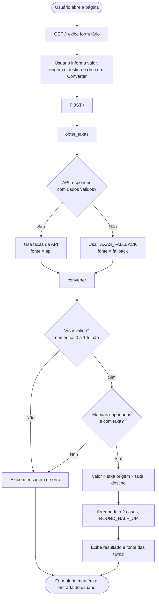

# Documentação Técnica — Conversor de Moedas

## 1. Descrição da funcionalidade

Aplicação web que converte um valor entre 7 moedas: **USD**, **EUR**, **BRL**, **GBP**, **JPY**, **CAD** e **ARS**.
O usuário informa o valor, escolhe a moeda de origem e a de destino e recebe o
equivalente com **duas casas decimais**, arredondado por **metade para cima**.

- As taxas vêm de uma API pública gratuita; se ela estiver indisponível, usa-se
  uma tabela pré-definida e a tela informa qual fonte foi usada.
- Não há login, sessão nem persistência: cada requisição é independente.

**Regra de cálculo.** As taxas são expressas em *unidades da moeda por 1 USD*
(USD = 1, EUR ≈ 0,88, BRL ≈ 5,19, GBP ≈ 0,76 etc.). A conversão passa sempre pelo dólar:

```
resultado = valor ÷ taxa[origem] × taxa[destino]      (arredondado a 0,01)
```

Toda a aritmética usa `decimal.Decimal` para evitar erros de ponto flutuante.

## 2. Diagrama de fluxo



## 3. Arquitetura e módulos

| Arquivo | Responsabilidade |
|---------|------------------|
| `conversor/core.py` | Regra de negócio: validação de valor/moeda, conversão, arredondamento e exceções (`ValorInvalidoError`, `MoedaInvalidaError`). Não depende de rede nem de Flask. |
| `conversor/taxas.py` | Obtém as taxas: `buscar_taxas_api()` consulta a API; `obter_taxas()` aplica o fallback e devolve `(taxas, fonte)`. |
| `conversor/web.py` | `create_app(provedor_taxas=None)`: fábrica da aplicação Flask; recebe o provedor de taxas por injeção (facilita testes). |
| `conversor/templates/index.html` | Página única com formulário, resultado, erro e indicação da fonte. |
| `app.py` | Ponto de entrada (`python app.py`). |

## 4. Interfaces

### 4.1 Interface HTTP

| Método | Rota | Descrição |
|--------|------|-----------|
| GET | `/` | Devolve o formulário (padrão: USD → BRL). |
| POST | `/` | Converte e devolve a mesma página com o resultado ou um erro. |

**Campos do formulário (POST, `application/x-www-form-urlencoded`)**

| Campo | Tipo | Regras |
|-------|------|--------|
| `valor` | texto | Número decimal com `.` ou `,`; de 0 a 1.000.000.000.000. Notação científica, separador de milhar e sinal negativo são rejeitados. |
| `origem` | texto | Uma das 7 moedas (`USD`, `EUR`, `BRL`, `GBP`, `JPY`, `CAD`, `ARS`), sem diferenciar maiúsculas de minúsculas. |
| `destino` | texto | Igual a `origem`. |

**Respostas.** Sempre `200 OK` com HTML: elemento `#resultado` em caso de
sucesso ou `#erro` (com `role="alert"`) em caso de falha; `#fonte` indica se as
taxas vieram da API ou do fallback.

### 4.2 Interface de código (funções públicas)

```python
converter(valor, origem, destino, taxas) -> Decimal
interpretar_valor(texto)                 -> Decimal
obter_taxas(buscador=buscar_taxas_api)   -> (dict[str, float], "api" | "fallback")
buscar_taxas_api(url, timeout)           -> dict[str, float]
create_app(provedor_taxas=None)          -> flask.Flask
```

**Mensagens de erro:** `Valor inválido: ...`, `Informe um valor numérico.`,
`O valor não pode ser negativo.`, `O valor não pode ser maior que ...`,
`Moeda não suportada: XXX.`

## 5. Banco de dados e armazenamento

**Não há banco de dados** nem armazenamento persistente. Os únicos dados fixos
ficam no código:

- `MOEDAS` (`core.py`): mapa código → nome das 7 moedas; `MOEDAS_SUPORTADAS` é derivada dele.
  Para incluir uma moeda, basta adicioná-la aqui e em `TAXAS_FALLBACK`;
- `TAXAS_FALLBACK` (`taxas.py`): taxas aproximadas por 1 USD (EUR 0,92; BRL 5,00;
  GBP 0,76; JPY 155; CAD 1,41; ARS 1500), usadas apenas quando a API falha.

As taxas são consultadas **a cada conversão**, sem cache.

## 6. APIs e serviços externos

| Item | Detalhe |
|------|---------|
| Serviço | ExchangeRate-API, endpoint aberto (sem chave) |
| URL | `https://open.er-api.com/v6/latest/USD` |
| Método | `GET`, timeout de 5 s |
| Resposta usada | `{"result": "success", "rates": {"USD": 1, "EUR": ..., "BRL": ..., ...}}` (as demais moedas da API são ignoradas) |
| Validação | `result == "success"` e taxa numérica positiva para cada uma das 7 moedas suportadas; qualquer outra coisa lança `ValueError`. |
| Falhas tratadas | Erro de rede, timeout, JSON inválido, resposta sem sucesso ou sem moeda → fallback. |

O endpoint aberto tem limite de requisições e exige atribuição à fonte; veja as
sugestões de cache em `docs/revisao.md`.

## 7. Como executar

```bash
pip install -r requirements.txt
python app.py              # http://127.0.0.1:5000
python -m unittest discover -v
```

## 8. Testes

54 testes com `unittest` (a API real é sempre simulada com `unittest.mock`,
portanto rodam offline): `tests/test_core.py` (regra de negócio),
`tests/test_taxas.py` (API e fallback) e `tests/test_web.py` (interface).
A rastreabilidade com os critérios está em `docs/criterios_aceitacao.md`.
